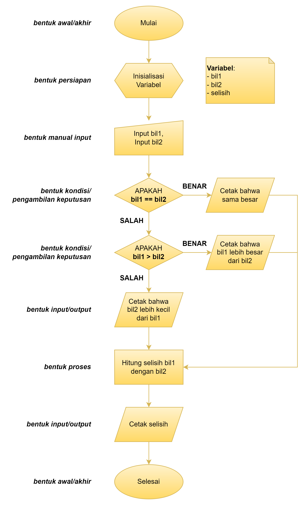
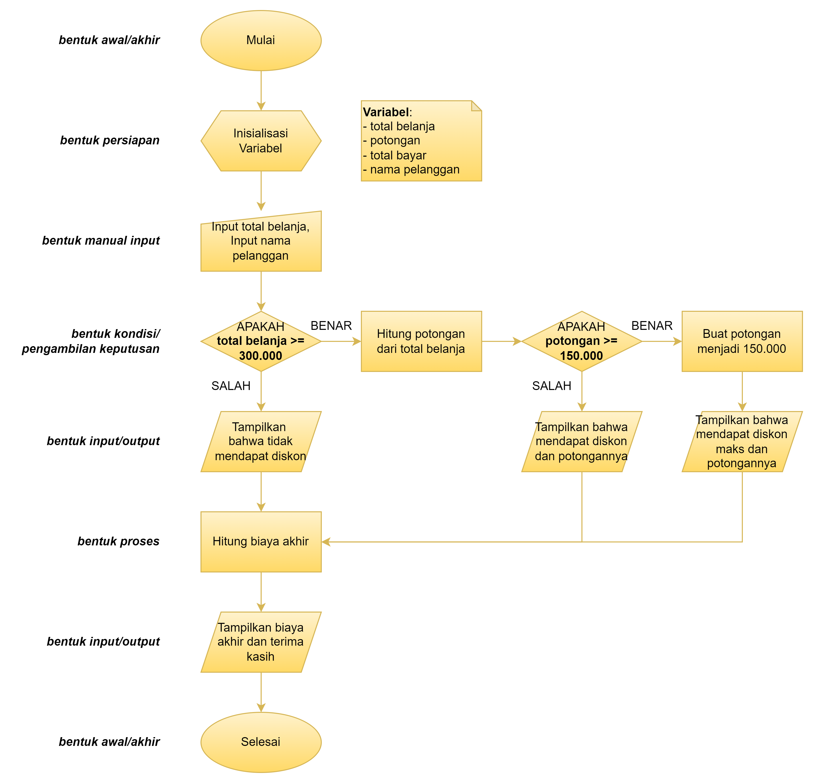

# Percabangan kondisi dalam Java

Percabangan kondisi merupakan hal dasar dalam pemrograman yang memudahkan
kita untuk membuat keputusan berdasarkan kondisi yang terjadi. Sebuah cabang
keputusan akan dijalankan bila dan hanya bila ekspresi yang diberikan bernilai
benar.

## Macam-macam percabangan kondisi

Terdapat beberapa macam percabangan kondisi dalam Java.
Berikut tabel yang menjelasakan beberapa macamnya:

| Pernyataan      | Penempatan             | Penggunaan                                                                                                                      |
|-----------------|------------------------|---------------------------------------------------------------------------------------------------------------------------------|
| `if (...)`      | Di awal                | Mengawali percabangan keputusan, jika ekspresi bernilai benar, maka blok kode di dalamnya akan dijalankan.                      |
| `else if (...)` | Setelah `if`           | Jika ekspresi pada `if` atau `else if` sebelumnya bernilai salah namun benar pada ekspresi sekarang, maka blok kode dijalankan. |
| `else`          | Setelah `if`/`else if` | Jika semua ekspresi sebelumnya pada `if` dan `else if` bernilai salah, maka blok kode di dalamnya akan dijalankan.              |

## Susah nih nangkepnya, bisa digambarin secara visual?

Bisa banget! Programmer gak cuma ngandalin pseudocode, bisa juga menggunakan
flowchart atau diagram alur.

### Contoh flowchart percabangan sedehana

Pada contoh <a href="src/A_PercabanganSederhana.java">Percabangan Sederhana</a>
terdapat:

Pseudocode
```text
DEKLARASI (bil1, bil2, selisih) SEBAGAI INTEGER
BACA bil1
BACA bil2
JIKA (bil1 SAMA DENGAN bil2) MAKA
    CETAK "Bilangan pertama dan kedua sama besar."
NAMUN JIKA (bil1 LEBIH BESAR DARI bil2) MAKA
    CETAK "Bilangan pertama lebih besar dari bilangan kedua."
SELAIN ITU
    CETAK "Bilangan 1 lebih kecil dari bilangan 2"
SIMPAN (bil1 - bil2 )KE selisih
CETAK "Selisih bilangan pertama dan bilangan kedua adalah " + selisih
```

Flowchart:


### Contoh flowchart percabangan bertingkat

Pada contoh <a href="src/B_PercabanganBertingkat.java">Percabangan Bertingkat</a>
terdapat:

Pseudocode
```text
DEKLARASI (totalBelanja, potongan, totalBayar) SEBAGAI DOUBLE
DEKLARASI namaPelanggan SEBAGAI STRING
BACA totalBelanja
BACA namaPelanggan

CETAK "Struk Belanja"

JIKA (totalBelanja LEBIH BESAR ATAU SAMA DENGAN 300.000) MAKA
    SIMPAN (0.15 * totalBelanja) KE potongan
    JIKA (potongan LEBIH BESAR DARI 150.000) MAKA
        SIMPAN 150.000 KE potongan
        CETAK "Diskon (MAKS)" + potongan
    SELAIN ITU
        CETAK "Diskon" + potongan
    AKHIR JIKA
SELAIN ITU
    CETAK "Tidak dapat diskon"

SIMPAN (totalBelanja - potongan) KE totalBayar
CETAK "Total Bayar" + totalBayar

CETAK "Terima kasih atas kunjungan Anda, " + namaPelanggan
```

Flowchart:


## Cuma itu?

Ada lagi sebenarnya, selain: IF, ELSE IF, dan ELSE; Ada juga SWITCH.
Materinya bakal dibahas kedepan.
